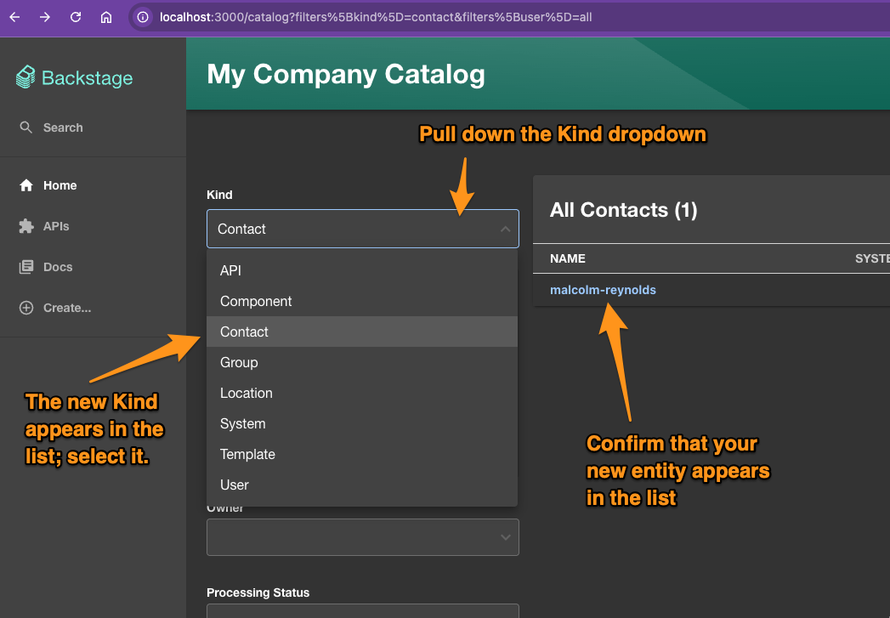
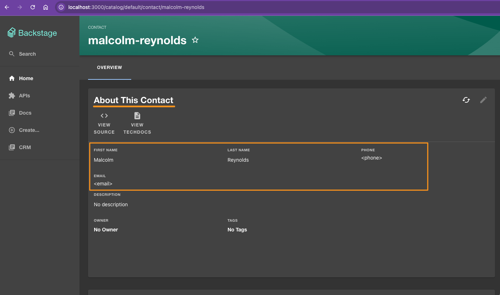

# Backstage-Starter

- [First Steps](#first-steps)
- [Local Development](#local-development)
- [Extending the `Catalog` model with custom Entity Kinds](#extending-the-catalog-model-with-custom-entity-kinds)

## First Steps

- Review and validate the Backstage [prerequisites](https://backstage.io/docs/getting-started/#prerequisites);

- To stand up backstage locally I followed the instructions from Backstage [Getting Started](https://backstage.io/docs/getting-started/)

  After a few false starts with yarn install errors I found a tooling combination that works:

  - `nodejs`: 22.21.1 (backstage create-app wants nodejs 20 or 22)

    ```
    asdf install nodesjs 22.21.1
    asdf local nodejs 22.21.1
    ```

  - `corepack`: enabled (allow a local package.json to lock yarn version)

    ```
    corepack enable
    ```

- This allowed the following bootstrap command to complete:

  ```
  npx @backstage/create-app@latest
  ```

  - I gave it the name 'burt', inspired by local Winnipeg musician Burton Cummings from the Guess Who, but you can give it any name you like.
    
    This name will be used to create a folder inside the current directory and the backstage starter template will be installed there:

    ```
    # ls -la
    .
    ..
    .git
    .tool-versions
    burt
    README.md
    ```

- After the create-app command completed successfully it said:
    
  ```
  🥇  Successfully created burt

   All set! Now you might want to:
    Run the app: cd burt && yarn start
    Set up the software catalog: https://backstage.io/docs/features/software-catalog/configuration
    Add authentication: https://backstage.io/docs/auth/
  ```

## Local Development

While you can run the app in the way suggested:

```
cd <your-app-folder>
yarn start
```

I find it helpful during development to separate frontend and backend logs:

- Open two terminals and in both change into they app folder (e.g. `cd burt`)

- In one start the backend

  ```
  yarn workspace backstage start
  ```

- In the other start the frontend

  ```
  yarn workspace app start
  ```

## Extending the `Catalog` model with custom Entity Kinds

1. create a new isomorphic/common plugin to hold your models and other logic your plugin may need to reuse between the frontend app and backend services:

    ```
    ❯ yarn new
    ? What do you want to create? plugin-common-library - A new isomorphic common plugin package
    ? Enter the ID of the plugin [required] crm
      templating    plugins/crm-common ✔
      executing     yarn install ✔
      executing     yarn lint --fix ✔

    🎉  Successfully created plugin-common-library
    ```

  1. add `@backstage/catalog-model` as a dependency so that you can extend it with your new custom Kind

    ```
    cd plugins/crm-common
    yarn add @backstage/catalog-model
    ```
  
  1. crib from an existing example (e.g. the `ApiEntity`) to add:

      | Function                      | Name                                 | Example Source                   |
      | ----------------------------- | ------------------------------------ | -------------------------------- |
      | model                         | [`ContactEntityV1Alpha1.ts`][1]      | [`ApiEntityV1alpha1.ts`][2]      |
      | unit tests                    | [`ContactEntityV1alpha1.test.ts`][3] | [`ApiEntityV1alpha1.test.ts`][4] |
      | schema<br/>used in validation | [`Contact.v1alpha1.schema`][5]       | [`API.v1alpha1.schema`][6]       |

      > [!NOTE]
      > Backstage guidance recommends that you define your own `apiVersion` value
      > (e.g. `crm.plugins.backstage.io/v1alpha1`) to namespace your custom schema
      > independently from the core Backstage model

2. create a new backend plugin to define and register a custom processor for entities of this new custom Kind

    ```
    ❯ yarn new
    ? What do you want to create? backend-plugin - A new backend plugin
    ? Enter the ID of the plugin [required] crm
      templating    plugins/crm-backend ✔
      backend       adding @internal/plugin-crm-backend ✔
      executing     yarn install ✔
      executing     yarn lint --fix ✔

    🎉  Successfully created backend-plugin
    ```

  1. create a new entity processor to be able to parse and validate your custom entity

      | Function  | Name                               | Example Source                        |
      | --------- | ---------------------------------- | ------------------------------------- |
      | processor | [`ContactEntitiesProcessor.ts`][7] | [`ScaffolderEntitiesProcessor.ts`][8] |

  1. define and export a new custom module to extend the Catalog plugin

      ```js
      export const crmCatalogModule = createBackendModule({
        pluginId: 'catalog',
        moduleId: 'crm-processor',
        register(env) {
          env.registerInit({
            deps: {
              catalog: catalogProcessingExtensionPoint,
              logger: coreServices.logger,
            },
            async init({ catalog, logger }) {
              logger.info('initializing the crm module');
      
              logger.info('register crm catalog processor');
              catalog.addProcessor(new ContactEntitiesProcessor());
            },
          });
        },
      });
      ```

      > [!WARNING]
      > The core extension model and types seem to have evolved since the Backstage documentation around [extending the processor](https://backstage.io/docs/features/software-catalog/extending-the-model#new-backend) was last updated as you can no longer use one plugin to extend another as implied in the example posted there:
      >
      >    ```js
      >    import {
      >      coreServices,
      >      createBackendModule,
      >    } from '@backstage/backend-plugin-api';
      >    import { catalogProcessingExtensionPoint } from '@backstage/plugin-catalog-node/alpha';
      >    import { FoobarEntitiesProcessor } from './providers';
      >
      >    export const catalogModuleFoobarEntitiesProcessor = createBackendModule({
      >      pluginId: 'catalog',
      >      moduleId: 'foobar',
      >      register(env) {
      >        env.registerInit({
      >          deps: {
      >            catalog: catalogProcessingExtensionPoint,
      >          },
      >          async init({ catalog }) {
      >            catalog.addProcessor(new FoobarEntitiesProcessor());
      >          },
      >        });
      >      },
      >    });
      >
      >    export default catalogModuleFoobarEntitiesProcessor;
      >    ```
      >
      >  - now you have to create a `Module` to extend a `Plugin`
      >  - the module's `pluginId` has to match the ID of the Plugin that you are extending
      >  - the module's `moduleId` is the unique identifier of this Module and can merge the custom plugin's id with the id of the plugin it is extending (e.g. `crmCatalogModule` is a Catalog module in the `crm` plugin)

3. Finally you have to update the Catalog configuration (i.e in `app-config.yaml`) to tell it that the new entity type is allowed:

    ``` yaml
    catalog:
      import:
        entityFilename: catalog-info.yaml
        pullRequestBranchName: backstage-integration
      rules:
        - allow: [Component, System, API, Resource, Location, Contact]
        #                                                     ^^^^^^^
        #----------------------------------------------------/
    ```

    > [!WARNING]
    > Updates to the root config files (e.g. `app-config.yaml`)
    > may require a restart before they will take effect.

4. Add a new instance of the custom Entity in one of your locations (e.g. `./examples/entities.yaml`)

    ```yaml
    ---
    apiVersion: crm.plugins.backstage.io/v1alpha1
    kind: Contact
    metadata:
      name: malcolm-reynolds
    spec:
      firstName: Malcolm
      lastName: Reynolds
    ```

5. Navigate to the relevant `Location` in the Catalog and request a refresh of that Location to load your new entity and validate that it is processed correctly:

    

1. Create a new Frontend plugin

    ```
    ❯ yarn new
    ? What do you want to create? frontend-plugin - A new frontend plugin
    ? Enter the ID of the plugin [required] crm
      templating    plugins/crm ✔
      app           adding import ✔
      executing     yarn install ✔
      executing     yarn lint --fix ✔
    
    🎉  Successfully created frontend-plugin
    ```

    1. Copy the following components from the `@backstage/plugin-catalog` into your `plugin-crm` package and update references as needed (most of them will go to `@backstage/plugin-catalog` or `@backstage/plugin-catalog/alpha`):

        - `AboutCard`
        - `EntityLinksCard`

    1. Update names (e.g. `ContactAboutCard` instead of `EntityAboutCard`)

    1. Update fields

1. Customize the Frontend

    1. Customize which kind is shown by default when you open the Catalog

        - https://backstage.io/docs/features/software-catalog/catalog-customization/#initially-selected-kind

        > [!WARNING]
        > The value of `initialKind` needs to be title cased (e.g. `Contact`), not
        > lower-cased like the column schema case statements.

    2. Customize the column schema

        - https://backstage.io/docs/features/software-catalog/catalog-customization/#adding-columns-to-a-custom-or-specific-kind

        > [!WARNING]
        > The value of `entityListContext.filters.kind?.value` is lowercase
        > so even though your `kind` value may be title cased (e.g. `Contact`)
        > this _value_ will be lowercased (e.g. `contact`) when matching to
        > customize the entity kind's columns in the Catalog list table view.

    3. Customize the About card content for your custom Entity Kind by making use of the `ContactAboutCard` from your frontend plugin created above:

        ``` ts
        import {
          ContactAboutCard
        } from '@internal/plugin-crm'

        // ...

        const contactPage = (
          <EntityLayout>
            <EntityLayout.Route path="/" title="Overview">
              <Grid container spacing={3} alignItems="stretch">
                {entityWarningContent}
                <Grid item md={6}>
                  <ContactAboutCard variant="gridItem" />
                </Grid>
                <Grid item md={6} xs={12}>
                  <EntityCatalogGraphCard variant="gridItem" height={400} />
                </Grid>
                <Grid item md={6}>
                  <EntityHasSystemsCard variant="gridItem" />
                </Grid>
              </Grid>
            </EntityLayout.Route>
          </EntityLayout>
        );

        // ...

        <EntitySwitch>
            <EntitySwitch.Case if={isKind('contact')} children={contactPage} />
        </EntitySwitch>
        ```

    4. Profit

        

[1]: ./burt/plugins/crm-common/src/kinds/ContactEntityV1alpha1.ts
[2]: https://github.com/backstage/backstage/blob/39591f4c27862afa45563989d800f9ebeae65adb/packages/catalog-model/src/kinds/ApiEntityV1alpha1.ts
[3]: ./burt/plugins/crm-common/src/kinds/ContactEntityV1alpha1.test.ts 
[4]: https://github.com/backstage/backstage/blob/39591f4c27862afa45563989d800f9ebeae65adb/packages/catalog-model/src/kinds/ApiEntityV1alpha1.test.ts
[5]: ./burt/plugins/crm-common/src/schema/kinds/Contact.v1alpha1.schema.json
[6]: https://github.com/backstage/backstage/blob/39591f4c27862afa45563989d800f9ebeae65adb/packages/catalog-model/src/schema/kinds/API.v1alpha1.schema.json
[7]: ./burt/plugins/crm-backend/src/processor/ContactEntitiesProcessor.ts
[8]: https://github.com/backstage/backstage/blob/39591f4c27862afa45563989d800f9ebeae65adb/plugins/catalog-backend-module-scaffolder-entity-model/src/processor/ScaffolderEntitiesProcessor.ts
